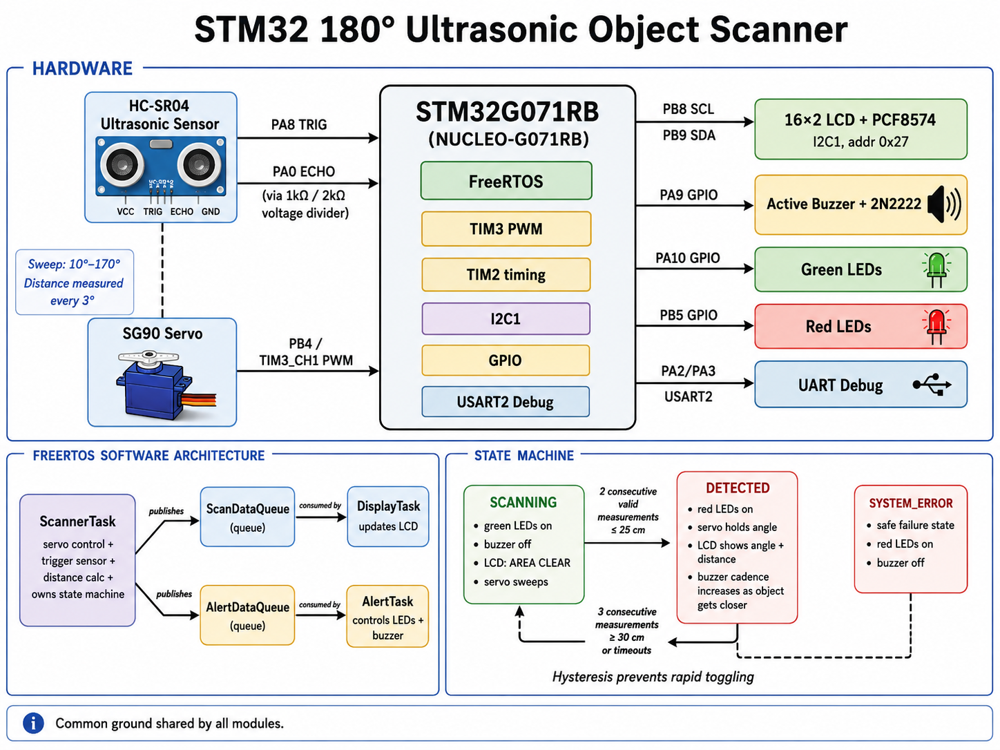

# STM32 180° Ultrasonic Object Scanner

A real-time embedded object-scanning system built with an **STM32G071RB**, **FreeRTOS**, an **SG90 servo**, and an **HC-SR04 ultrasonic sensor**.

The system continuously scans its surroundings, measures distance at different angles, stops at the angle where an object is detected, and provides live visual and audible feedback. When the object is removed, the system automatically returns to scanning.

## System Architecture Overview

The diagram below summarizes the complete system in one view: the hardware connections to the STM32, the FreeRTOS task and queue architecture, and the transitions between the main operating states.



- The hardware section shows how the servo, ultrasonic sensor, LCD, LEDs, buzzer, and UART are connected to the STM32.
- The FreeRTOS section shows how `ScannerTask` publishes complete measurement snapshots to separate queues for `DisplayTask` and `AlertTask`.
- The state-machine section shows the transition from `SCANNING` to `DETECTED`, the hysteresis used to prevent rapid toggling, and the safe `SYSTEM_ERROR` state.

## System Behavior

### SCANNING

- The servo sweeps between **10° and 170°**.
- The ultrasonic sensor measures distance every **3°**.
- The green LEDs are on.
- The red LEDs and buzzer are off.
- The LCD displays `AREA CLEAR` and the current scan angle.

### DETECTED

- The servo stops and holds the detection angle.
- The sensor continues measuring at the same angle.
- The red LEDs are on and the green LEDs are off.
- The LCD displays the detection angle and distance.
- The buzzer beeps faster as the object moves closer.

The system returns to `SCANNING` after the object is removed.

## Software Architecture

The firmware is divided into three FreeRTOS tasks:

```text
                         ┌─ ScanDataQueue  ─► DisplayTask ─► LCD
ScannerTask ─────────────┤
                         └─ AlertDataQueue ─► AlertTask   ─► LEDs + Buzzer
```

- **ScannerTask** controls the servo, triggers ultrasonic measurements, calculates distance, and owns the system state machine.
- **DisplayTask** receives complete measurement snapshots and updates the LCD.
- **AlertTask** controls the status LEDs and generates a non-blocking buzzer pattern.

Two queues are used because receiving a message removes it from a queue. `ScannerTask` therefore sends an independent copy of each measurement to both consumers.

Each message contains:

```c
typedef struct
{
    SystemState_t state;
    uint16_t angleDeg;
    uint16_t distanceCm;
    uint8_t measurementValid;
} ScanMessage_t;
```

## State Machine

```text
SCANNING
   │
   │ Two consecutive valid measurements ≤ 25 cm
   ▼
DETECTED
   │
   │ Three consecutive measurements ≥ 30 cm
   │ or three consecutive timeouts
   ▼
SCANNING
```

Separate detection and release thresholds provide **hysteresis**, preventing rapid state changes when measurements fluctuate near the boundary.

`SYSTEM_ERROR` is reserved for safe failure handling. If an RTOS task or queue cannot be created during startup, the servo returns to the center, the buzzer remains off, the red LEDs turn on, and the LCD displays an RTOS startup error.

## Key Technical Details

### Servo Control

`TIM3 Channel 1` generates a hardware PWM signal for the SG90 servo.

- System clock: **64 MHz**
- Prescaler: **63**
- Timer tick: **1 µs**
- Period: **19,999**
- PWM period: **20 ms / 50 Hz**
- Pulse range: approximately **1,000–2,000 µs**

The servo moves in 1° steps. The practical sweep is limited to 10°–170° to avoid stressing the mechanical end stops.

### Ultrasonic Measurement

The HC-SR04 is triggered by a 10 µs pulse. `TIM2` is used as a 1 µs stopwatch to measure the ECHO pulse width.

```text
distance_cm = echo_pulse_us / 58
```

A **30 ms timeout** prevents the firmware from becoming trapped if no valid echo is received.

The HC-SR04 ECHO output is reduced from 5 V to approximately 3.3 V using a **1 kΩ / 2 kΩ voltage divider** before reaching the STM32 input.

### LCD

A 16×2 LCD is controlled through a PCF8574 I2C backpack.

- Interface: **I2C1**
- Address: **0x27**
- Bus speed: **100 kHz**
- Driver functions include initialization, clearing, cursor positioning, and text output.

### Buzzer Driver

An active buzzer is powered from 5 V and switched using a **2N2222 NPN transistor**. The STM32 drives the transistor base through a **1 kΩ resistor**, so the GPIO pin only supplies a small control current.

The buzzer timing is non-blocking. `AlertTask` wakes periodically, processes new measurements, and updates the output according to the RTOS tick count instead of using long delays.

## Hardware

- NUCLEO-G071RB development board
- STM32G071RB microcontroller
- SG90 servo motor
- HC-SR04 ultrasonic sensor
- 16×2 I2C LCD with PCF8574 backpack
- Active buzzer
- 2N2222 NPN transistor
- Green and red status LEDs
- 1 kΩ and 2 kΩ resistors
- Breadboard and jumper wires

## Pin Mapping

| Function | STM32 Pin | Peripheral |
|---|---:|---|
| Servo control | PB4 | TIM3_CH1 PWM |
| HC-SR04 TRIG | PA8 | GPIO output |
| HC-SR04 ECHO | PA0 | GPIO input through voltage divider |
| LCD SCL | PB8 | I2C1_SCL |
| LCD SDA | PB9 | I2C1_SDA |
| Buzzer control | PA9 | GPIO output |
| Green LEDs | PA10 | GPIO output |
| Red LEDs | PB5 | GPIO output |
| UART TX | PA2 | USART2_TX |
| UART RX | PA3 | USART2_RX |

All modules share a common ground.

## Development and Validation Approach

The project was developed incrementally to isolate failures before integration:

1. Board bring-up with the onboard LED and UART.
2. Independent validation of the external LEDs.
3. Servo PWM generation and angle verification.
4. HC-SR04 trigger, echo timing, and UART distance output.
5. LCD driver and I2C communication.
6. Buzzer switching through the 2N2222 transistor.
7. Combined servo sweep and ultrasonic measurements.
8. FreeRTOS tasks and queue-based communication.
9. State-machine behavior, distance-based alerts, and system validation.

This approach made it easier to distinguish between wiring, peripheral configuration, timing, and application-logic problems.

Runtime stack and heap diagnostics were also performed after exercising the complete system. The measured margins were sufficient for all three tasks and the configured FreeRTOS heap.

## Build and Run

1. Clone the repository.
2. Open the project in **STM32CubeIDE**.
3. Open `UltrasonicScanner.ioc` to review the CubeMX configuration.
4. Connect the hardware according to the pin-mapping table.
5. Build the project.
6. Connect the NUCLEO board through ST-LINK and flash the firmware.
7. Reset the board.

The LCD should first display the startup message and then enter the scanning state.

## Main Project Files

```text
Core/
├── Inc/
│   └── lcd_i2c.h
└── Src/
    ├── lcd_i2c.c
    └── main.c

UltrasonicScanner.ioc
```
